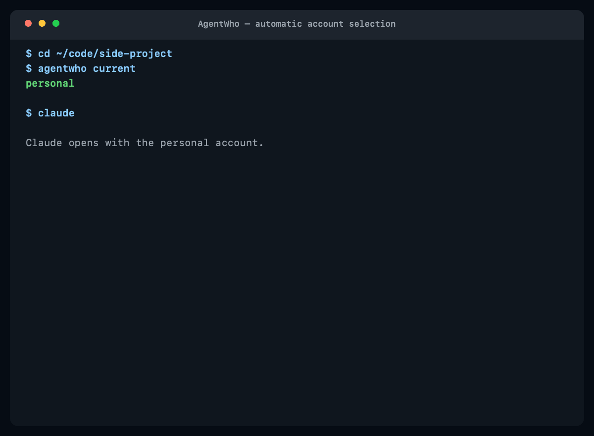
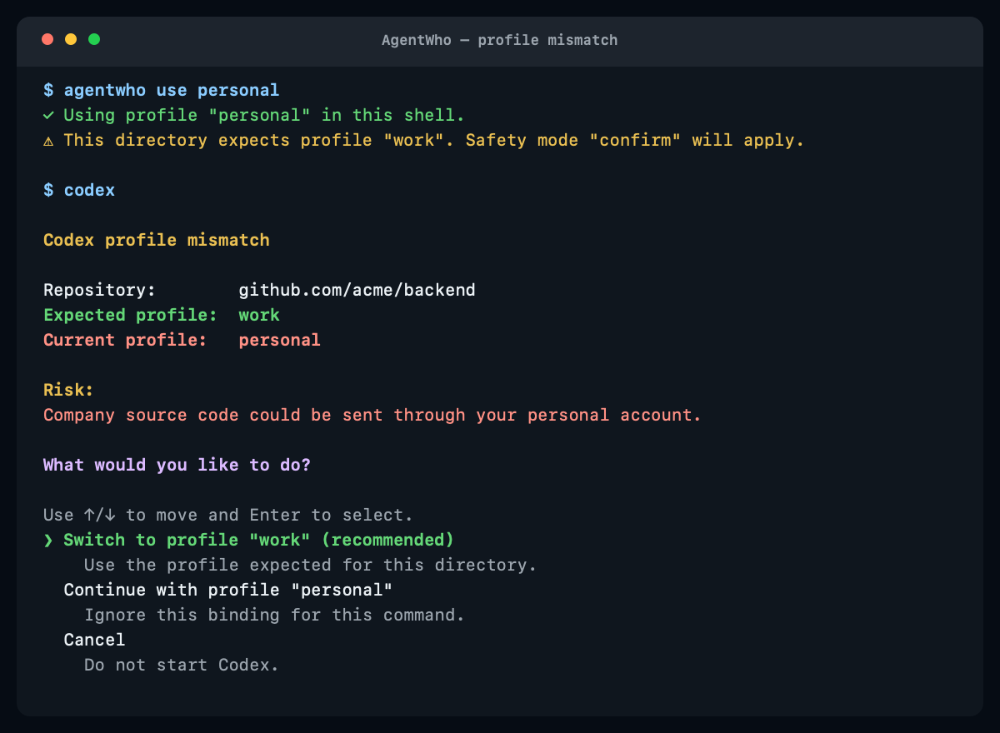
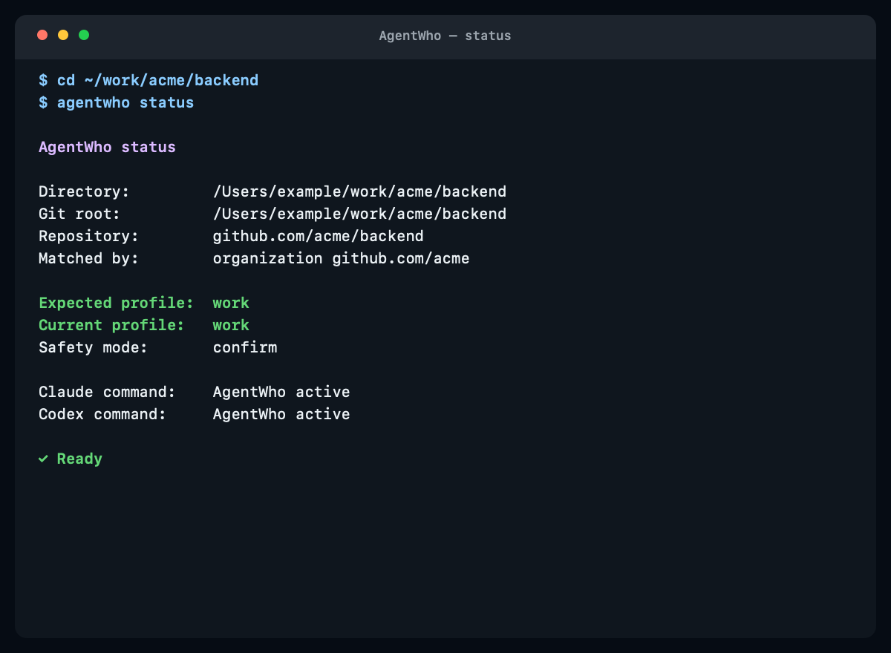
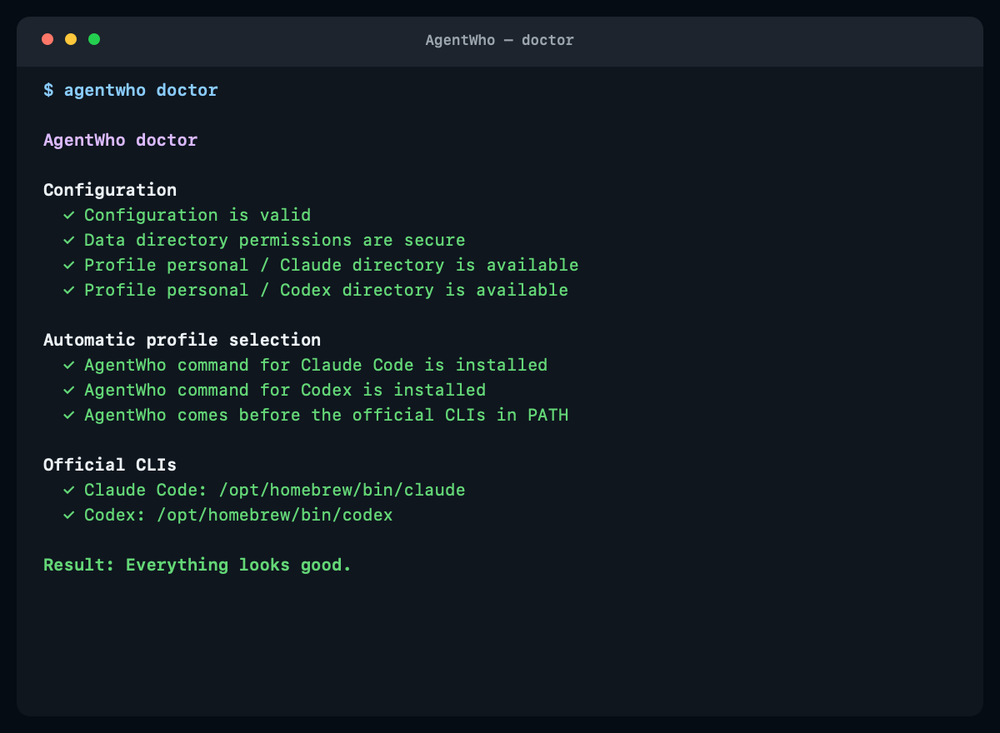

# AgentWho

> **Automatically uses the correct Claude and Codex account for every project.**

**You never have to remember to switch AI accounts again.**



[](https://github.com/irangarcia/agentwho/actions/workflows/ci.yml)
[](https://github.com/irangarcia/agentwho/actions/workflows/lint.yml)
[](https://github.com/irangarcia/agentwho/releases/latest)
[](LICENSE)
[](https://github.com/irangarcia/homebrew-tap)

Install with Homebrew:

```sh
brew install irangarcia/tap/agentwho
agentwho init
```

```console
$ cd ~/work/acme/backend
$ agentwho current
work

$ claude
# Claude starts with the work account automatically.

$ agentwho use personal
✓ Using profile "personal" in this shell.
⚠ This directory expects profile "work". Safety mode "confirm" will apply.

$ codex
Codex profile mismatch

Repository:        github.com/acme/backend
Expected profile:  work
Current profile:   personal

Risk:
Company source code could be sent through your personal account.

What would you like to do?
❯ Switch to profile "work" (recommended)
  Continue with profile "personal"
  Cancel

Using profile "work" for this command.
```

You keep running the original `claude` and `codex` commands. Credentials remain fully managed by the official Claude and Codex CLIs—AgentWho never reads, copies, migrates, or displays them.

## Why AgentWho?

Claude Code and Codex CLI each keep a signed-in account on your computer. If you work across personal and company projects, it is easy to open the right repository with the wrong account.

That mistake works both ways:

- company source code can be sent through a personal AI account;
- personal source code can be exposed to a company-managed AI account.

Remembering to switch manually is unreliable. AgentWho binds an account identity to a repository, organization, or directory tree and applies it automatically whenever you run Claude or Codex there.

## How it works

AgentWho:

1. identifies the current repository or directory;
2. resolves which personal or work profile the project expects;
3. protects against conflicting explicit selections;
4. launches the official Claude or Codex CLI with that profile's isolated account state.

The real Claude and Codex executables are never replaced. See [Architecture](docs/architecture.md) for shim installation, executable discovery, recursion prevention, environment isolation, and process behavior.

## Installation

### Homebrew (recommended)

```sh
brew install irangarcia/tap/agentwho
agentwho init
```

### With Go

```sh
go install github.com/irangarcia/agentwho/cmd/agentwho@latest
agentwho init
```

If `agentwho` is not found after installation, add `$(go env GOPATH)/bin` to your `PATH`.

### From source

```sh
git clone https://github.com/irangarcia/agentwho.git
cd agentwho
make test
make install
exec "$SHELL" -l
agentwho init
```

`make install` uses `~/.local/bin` by default. It asks before changing a shell file and creates a backup first. Set `PREFIX` to install elsewhere:

```sh
make install PREFIX=/usr/local
```

## Requirements

- macOS or Linux;
- zsh, bash, or fish;
- Go 1.22 or newer when installing from source;
- the official Claude Code and/or Codex CLI installed separately.

AgentWho does not install Claude Code or Codex CLI.

## Set up AgentWho

Run the interactive onboarding:

```sh
agentwho init
```

Using arrow-key menus, AgentWho will:

1. create a `personal` profile;
2. optionally create a `work` profile;
3. choose the default account and safety mode;
4. offer to protect the normal `claude` and `codex` commands;
5. show optional terminal prompt instructions.

No shell file is changed without confirmation. If you skip terminal integration, enable it later:

```sh
agentwho install --modify-shell
```

Then verify everything:

```sh
agentwho doctor
agentwho status
```

## Create and sign in to accounts

Each profile represents one isolated Claude and Codex identity:

```sh
agentwho profile add work --kind work
agentwho profile login work claude
agentwho profile login work codex
agentwho profile list
```

If onboarding already created `work`, skip the `profile add` command.

Sign in independently for every profile and agent you use. `profile list` obtains sign-in status only by asking the official CLIs; one missing or signed-out agent does not break the list.

## Bind projects to accounts

### One repository

```sh
cd ~/work/acme/backend
agentwho bind work --repo --safety-mode block
```

### Every repository in an organization

```sh
cd ~/work/acme/backend
agentwho bind work --organization --safety-mode block
```

For `git@github.com:acme/backend.git`, this applies to every repository in `github.com/acme`.

### A directory and everything below it

```sh
agentwho bind personal --path ~/projects/personal --safety-mode confirm
```

Or use the interactive scope picker:

```sh
cd ~/work/acme/backend
agentwho bind work
```

A binding changes the account AgentWho automatically expects in that context. It does not manually switch every other terminal or project.

Resolution is deterministic: exact repository, organization, longest directory match, then default. See [Configuration](docs/configuration.md) for normalization, precedence, and the complete schema.

## Safety modes

Bindings can use either safety mode:

- **block** — never launch Claude or Codex when the current account conflicts with the expected account;
- **confirm** — explain the risk and offer to use the expected account, continue once, or cancel.

Confirmation defaults to the expected account. Non-interactive confirmation refuses execution.



### Choose an account for this shell

Most of the time, bindings should choose automatically. When you intentionally want another account in the current shell:

```sh
agentwho use personal
```

The terminal prompt and `agentwho status` update immediately. Return to repository-based selection with:

```sh
agentwho use --auto
```

Shell selections still go through mismatch protection. `AGENTWHO_FORCE=1` exists only as a visible emergency bypass and requires additional confirmation; see [Configuration](docs/configuration.md#explicit-selection-and-bypass).

## Check the current account

```sh
agentwho status
agentwho current
```

`status` explains the current directory, matched binding, expected account, current account, safety mode, and command integration. `current` is the stable minimal interface for scripts and prints only the account profile name.



JSON is available where useful:

```sh
agentwho status --json
agentwho current --json
agentwho rules --json
agentwho profile list --json
agentwho prompt --json
```

## Terminal prompt indicator

AgentWho can add `[agent:work]` to your existing prompt without replacing it:

```sh
agentwho prompt
# [agent:work]
```

A conflicting explicit account prints `[agent:personal!]`.

```sh
# zsh
setopt PROMPT_SUBST
PROMPT='$(agentwho prompt --plain) '"$PROMPT"

# bash
PS1='$(agentwho prompt --plain) '"$PS1"
```

The prompt command is local and fast: no network, agent, or authentication calls.

## Find commands

```sh
agentwho help
agentwho <command> --help
```

See the [documentation index](docs/README.md) for architecture, configuration, editor behavior, limitations, and troubleshooting.

## FAQ

### Does AgentWho read my credentials?

No. AgentWho never reads or parses credential files. The official Claude and Codex CLIs perform login and status checks inside isolated directories owned by each AgentWho profile.

### Does it work with VS Code?

Yes in the integrated terminal when AgentWho shell integration is active. Graphical Claude or Codex extension panels are not protected in this version because they may bypass terminal commands. See [VS Code integration](docs/vscode.md).

### Does it modify Claude or Codex?

No. AgentWho places its own reversible commands in its own data directory. It never renames, moves, overwrites, or deletes the official executables. See [Architecture](docs/architecture.md).

## Troubleshooting

Run:

```sh
agentwho doctor
```

Doctor checks configuration, permissions, account directories, command integration, `PATH` order, official CLI discovery, recursion risks, shell setup, and sign-in status. Every failure includes a suggested fix.



If integration is installed but not active in the current zsh session:

```sh
eval "$(agentwho shell init zsh)"
```

See [VS Code integration](docs/vscode.md) for editor-terminal checks and [Known limitations](docs/limitations.md) for current scope.

## Uninstall

Disable automatic account selection while retaining all profiles and sign-ins:

```sh
agentwho uninstall
```

Also remove the backed-up, clearly delimited shell block:

```sh
agentwho uninstall --remove-shell
```

Permanently remove AgentWho configuration, profile directories, and the official CLI sign-ins stored inside them:

```sh
agentwho uninstall --purge
```

`--purge` requires typing `purge`. It never removes the official Claude or Codex applications.

## Contributing

See [CONTRIBUTING.md](CONTRIBUTING.md) for development setup, tests, package layout, and pull-request guidance.

## License

AgentWho is available under the [MIT License](LICENSE).
