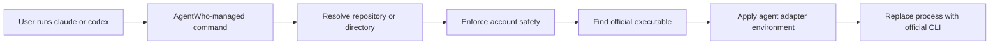

# Architecture

AgentWho automatically uses the correct Claude and Codex account for every project while leaving both official CLIs unchanged.

## Components



The implementation is split into focused internal packages:

- `internal/config` parses, validates, and atomically persists configuration;
- `internal/gitctx` detects Git context and normalizes remote and filesystem paths;
- `internal/resolve` applies deterministic binding precedence;
- `internal/enforce` handles bidirectional mismatch safety;
- `internal/agent` isolates Claude- and Codex-specific behavior;
- `internal/execution` discovers and launches the official executable;
- `internal/shim` safely installs and removes managed commands;
- `internal/shell` generates reversible zsh, bash, and fish integration;
- `internal/cli` contains thin Cobra command handlers and presentation logic.

## Managed command installation

AgentWho creates two small POSIX scripts:

```text
${XDG_DATA_HOME:-~/.local/share}/agentwho/bin/claude
${XDG_DATA_HOME:-~/.local/share}/agentwho/bin/codex
```

Each contains a management marker and executes the absolute AgentWho executable:

```sh
#!/bin/sh
# agentwho-managed-shim-v1
exec '/absolute/path/to/agentwho' internal exec claude "$@"
```

The Codex command is identical except for the final agent name. Arguments remain separate shell arguments; repository content is never interpolated into the script.

Installation refuses to overwrite an existing file unless it contains AgentWho's management marker. Removal applies the same check, so AgentWho cannot silently overwrite or delete an official or user-owned executable.

Shell initialization prepends the managed-command directory only when it is not already present in `PATH`. Shell-file modification is opt-in, backed up first, clearly delimited, duplicate-aware, and reversible.

The generated shell code also defines a transparent `agentwho` function. Every command delegates to the real executable except `agentwho use`, which evaluates a validated assignment in the current shell. This is how `agentwho use work` can be shell-local without a daemon or global state file. Profile values are validated safe slugs before shell code is emitted.

## Context detection

For every launch, AgentWho obtains the current working directory and canonicalizes it. It asks Git for:

```text
git rev-parse --show-toplevel
git remote get-url origin
```

Git runs with terminal prompting disabled and optional locks disabled. A repository cannot provide an AgentWho policy file or executable configuration. If the directory is not a Git repository or has no usable `origin`, path rules and the default profile still work.

Remote strings are parsed as data, never executed. SSH, SCP-style, and HTTPS remotes normalize to the same host/path representation. See [Configuration](configuration.md#git-remote-normalization).

## Profile resolution

Resolution uses a fixed precedence:

1. exact normalized Git repository;
2. Git organization or top-level namespace;
3. longest containing directory path;
4. default profile.

The resolver returns the expected profile, safety mode, matched rule, and specificity explanation. It does not inspect account data.

## Mismatch enforcement

Without an explicit shell selection, the current profile is the expected profile and execution continues quietly. `agentwho use <profile>` creates a shell-local explicit selection; `agentwho use --auto` removes it.

An explicit selection can conflict with the expected profile. `internal/enforce` protects both directions:

- work expected, personal selected;
- personal expected, work selected.

`block` always refuses. `confirm` offers the expected profile first, the explicit profile second, and cancellation third. A non-interactive confirmation refuses. `AGENTWHO_FORCE=1` remains visible and requires the safeguards documented in [Configuration](configuration.md#explicit-selection-and-bypass).

The enforcement result is the only profile passed to the agent adapter.

## Official executable discovery

The managed command must not rediscover itself. AgentWho therefore:

1. resolves the absolute managed-command directory;
2. splits the current `PATH` without invoking a shell;
3. excludes every canonical occurrence of its own directory;
4. searches remaining entries in order for the requested executable;
5. requires a regular executable file;
6. compares canonical paths and file identity to reject recursion;
7. uses the first valid official executable found.

Discovery runs on every invocation. Homebrew upgrades, Node package-manager changes, and newly installed official CLIs therefore require no stored executable path.

## Agent adapters

Agent-specific behavior lives behind a small adapter interface.

### Claude Code

- executable: `claude`;
- profile variable: `CLAUDE_CONFIG_DIR`;
- login arguments: `auth login`;
- status arguments: `auth status`.

### Codex CLI

- executable: `codex`;
- profile variable: `CODEX_HOME`;
- login arguments: `login`;
- status arguments: `login status`.

The adapter preserves the existing environment except that it replaces its own configuration variable with exactly one profile directory. It never opens files inside that directory.

Official status commands run with the same isolated environment and a short timeout. Their exit result is mapped to `authenticated`, `not authenticated`, `unavailable`, or `unknown`; stdout and stderr are discarded.

## Process execution

On supported Unix systems, AgentWho calls `syscall.Exec` with:

- the absolute official executable path;
- the original argument array;
- the preserved environment plus the selected profile directory.

No `sh -c`, argument interpolation, or repository-provided command is involved. Replacing the current process preserves stdin, stdout, stderr, terminal ownership, signals, and the official CLI's exit code.

Before execution, AgentWho removes `AGENTWHO_FORCE` and normalizes `AGENTWHO_PROFILE` to the profile that enforcement actually selected. Another profile's `CLAUDE_CONFIG_DIR` or `CODEX_HOME` is replaced, not inherited.

## Security boundaries

AgentWho does not:

- read or parse tokens, Claude credentials, or Codex `auth.json`;
- copy, migrate, or synchronize credentials;
- store API keys;
- evaluate repository-local AgentWho configuration;
- invoke commands through a shell;
- print complete environments;
- send telemetry or make network calls of its own;
- silently bypass mismatch safety;
- overwrite or delete an unmanaged executable.

Configuration and data directories use restrictive permissions. Configuration updates are validated, written to a same-directory temporary file, synchronized, and atomically renamed.

## Performance

Normal execution performs local configuration loading, working-directory normalization, two non-interactive Git queries when applicable, rule resolution, and `PATH` scanning. It makes no AgentWho network request.

`agentwho prompt` follows a smaller local-only path. It never invokes Claude, Codex, or authentication status commands and produces no output when AgentWho is uninitialized.

## Terminal styling

Interactive human output uses the same semantic palette as the documentation screenshots:

- purple for titles and section prompts;
- blue for informational emphasis;
- green for expected profiles and success;
- yellow for safety warnings;
- red for conflicting profiles, risk, and blocked execution;
- gray for secondary instructions.

Color is emitted only to an interactive terminal. Redirected output, JSON, `agentwho current`, and prompt text remain free of ANSI styling. Set `NO_COLOR=1` to disable color explicitly.
